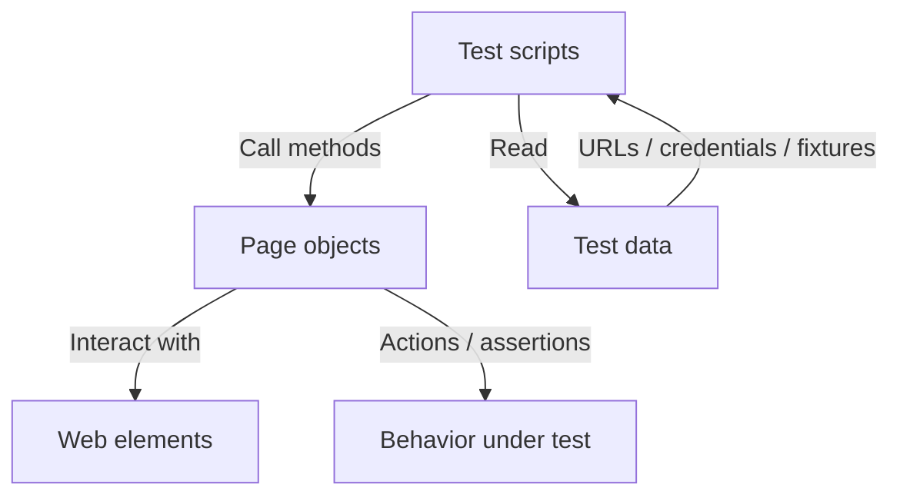

# playwright

Repository for Playwright learnings and practice projects.

## Project structure

```
playwright/
├── data/
│   ├── jobcompass_testdata.json
│   └── testdata.json
├── pages/
│   ├── adhocpages/
│   └── jobcompass/
├── tests/
│   ├── smoketests/
│   ├── resources/
│   └── *.spec.js
├── .auth/
├── mcp-server.js
├── MCP_README.md
├── playwright-report/
├── test-results/
├── playwright.config.js
├── package.json
└── README.md
```

## Running tests

From the `playwright` directory:

```bash
# All tests
npx playwright test

# Job Compass smoke tests (recommended)
npm run smoke

# Job Compass smoke tests with browser visible
npm run smoke -- --headed

# Job Compass smoke tests and open report
npm run smoke:report
```

### Authentication setup

Smoke tests use `tests/smoketests/smoke.config.js`, which runs `smoketest.setup.js` and refreshes the authenticated session in `.auth/smoketest.json`.

Use `npm run smoke` so the setup runs before the smoke specs. Running the specs without that config can fail if the stored session is missing or expired.

Install browsers if needed:

```bash
npx playwright install
```

## MCP server

This repo also includes a local MCP server for AI-assisted test discovery, smoke test execution, and report/test-data inspection.

```bash
npm run mcp
```

See `MCP_README.md` for setup and integration details.

## Page Object Model (overview)

This repo uses the Page Object Model so tests stay readable while selectors and UI actions live in reusable page classes. Test data is kept separately under `data/`.



## Tech stack

Node.js, Playwright Test, JavaScript, and JSON-based test data.
