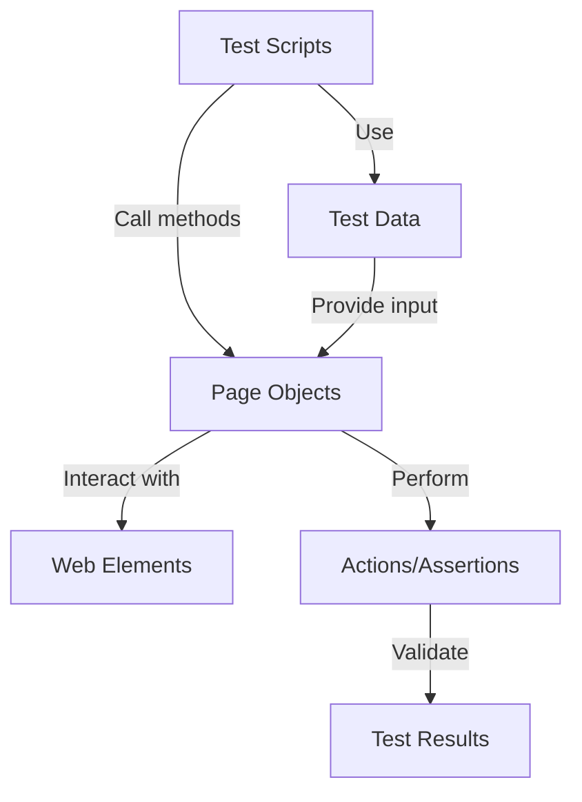

# playwright
Repository contains all code learnings and practices with playwright

## Project Structure

```
playwright/
├── data/
│   ├── jobcompass_testdata.json
│   └── testdata.json
├── pages/
│   ├── adhocpages/
│   │   ├── loginpage.js
│   │   └── logoutpage.js
│   └── jobcompass/
│       ├── jobcompassloginpage.js
│       └── jobcompasslogoutpage.js
├── tests/
│   ├── addingdatausingjsonfile.spec.js
│   ├── datadrivenjobcompasslogintest.spec.js
│   ├── datadrivenlogintest.spec.js
│   ├── dropdown.spec.js
│   ├── errorverification.spec.js
│   ├── example.spec.js
│   ├── firstplaywrighttest.spec.js
│   ├── loginandlogoutjobcompasspage.spec.js
│   ├── loginandlogoutpage.spec.js
│   ├── loginlogout.spec.js
│   ├── mouseover.spec.js
│   ├── uploadfile.spec.js
│   └── resources/
│       └── samplefile.txt
├── playwright-report/
│   ├── index.html
│   └── data/
├── test-results/
├── .git/
├── .gitignore
├── node_modules/
├── Commands.txt
├── README.md
├── package.json
├── package-lock.json
├── playwright.config.js
└── npm-path.rtf
```

## Page Object Model Architecture

The project follows the Page Object Model (POM) design pattern, which promotes better test maintenance and reduces code duplication by encapsulating page-specific logic into dedicated classes.



## Tech Stack

- **Node.js**: JavaScript runtime environment for executing the tests.
- **Playwright**: End-to-end testing framework for web applications, supporting multiple browsers.
- **JavaScript**: Programming language used for writing test scripts and page objects.
- **JSON**: Data format for storing test data (e.g., login credentials).
- **HTML**: Format for generating test reports via Playwright's built-in reporter.
- **CommonJS**: Module system used for importing/exporting code (e.g., require/module.exports).

