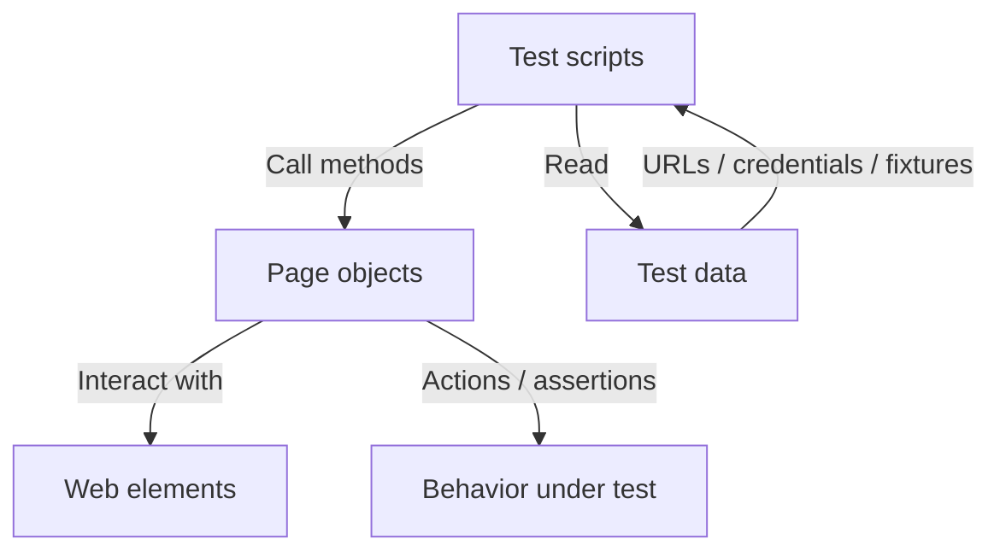

# playwright

Repository for Playwright learnings and practice projects.

## Project structure

```
playwright/
├── data/
│   ├── jobcompass_testdata.json    # URLs, credentials, application fixtures (Job Compass)
│   └── testdata.json
├── pages/
│   ├── adhocpages/                 # Generic demo pages (e.g. the-internet, OrangeHRM)
│   │   ├── loginpage.js
│   │   └── logoutpage.js
│   └── jobcompass/                 # Job Compass app — Page Object Model
│       ├── JobCompassLoginPage.js
│       ├── JobCompassLogoutPage.js
│       ├── JobCompassApplicationPage.js
│       └── JobCompassDashboardPage.js
├── tests/
│   ├── smoketests/                 # Job Compass smoke flows
│   │   ├── dashboardpage.spec.js
│   │   ├── addapplication.spec.js
│   │   └── loginandlogoutjobcompasspage.spec.js
│   ├── resources/
│   │   └── samplefile.txt
│   ├── *.spec.js                   # Other learning / demo specs
│   └── datadrivenjobcompasslogintest.spec.js
├── playwright-report/
├── test-results/
├── playwright.config.js            # ESM (`import` / `export default`)
├── package.json
├── package-lock.json
└── README.md
```

## Job Compass — Page Object conventions

- **One class per file**, **default export**: `module.exports = JobCompassLoginPage` (and the same pattern for other pages). Specs use `const LoginPage = require('...'); new LoginPage(page)`.
- **PascalCase** filenames match the class name (e.g. `JobCompassDashboardPage.js`) to avoid case-sensitivity issues on Linux/CI and in the TypeScript/JS language service on macOS.
- **Navigation**: `JobCompassLoginPage.goto(url)` takes the URL from the test (typically `testData[0].url` from JSON), not hard-coded inside the page object.
- **Locators vs methods**: avoid giving a locator the same name as a method (e.g. use `jobCompassAddApplication` for the button locator and `addApplication()` for the click action).
- **Assertions**: Job Compass dashboard checks can live in page helpers (e.g. `verifyDashboardTitle()`) or in specs; stay consistent as you add tests.

## Running tests

From the `playwright` directory:

```bash
npx playwright test
```

Job Compass smokes only:

```bash
npx playwright test tests/smoketests
```

Install browsers if needed:

```bash
npx playwright install
```

## Page Object Model (overview)

Tests call page objects; page objects encapsulate selectors and actions (and optional verification helpers). Shared data lives under `data/` or environment variables for sensitive values.



## Tech stack

- **Node.js** — runtime
- **@playwright/test** — test runner and browser automation
- **JavaScript** — specs and page objects use **CommonJS** (`require` / `module.exports`)
- **playwright.config.js** — **ESM** (`import` / `export default`), as supported by Playwright
- **JSON** — structured test data
- **HTML** — Playwright HTML reporter output under `playwright-report/`
